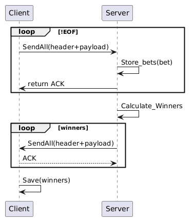
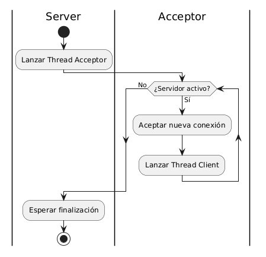
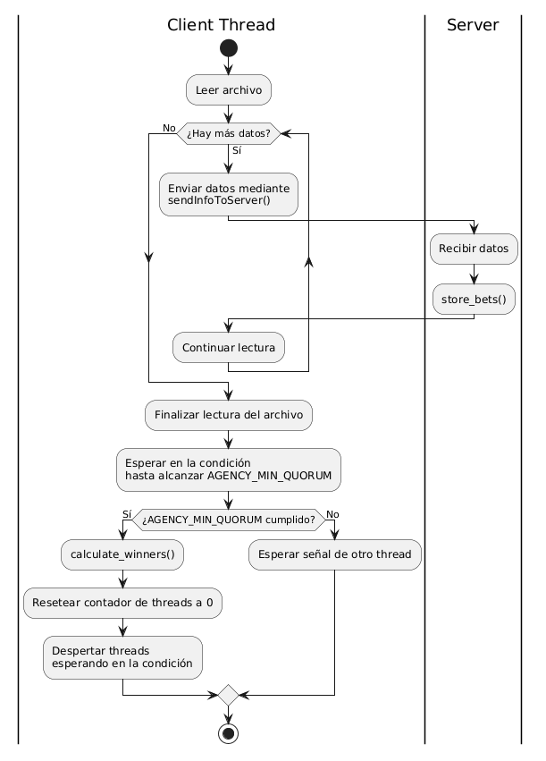
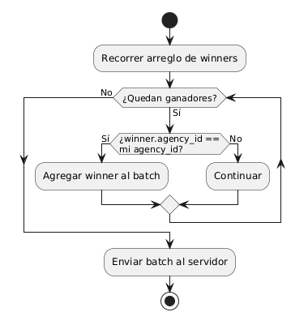

Redactar un breve informe en donde se detallen los aspectos más importantes de la solución provista, como ser el protocolo de comunicación implementado y los mecanismos para sincronizar la ejecución concurrente.

# Alumno: Lisandro Román 
# Padrón: 107274

## Introducción
En el presente informe se detallan los puntos más críticos del enunciado, el protocolo y la sincronización y de esta manera se comenta la solucion abordada y el trabajo en su completitud.

## Protocolo
Para el protocolo se eligió un header de 5 bytes para el cliente
el 1er byte es para el tipo de mensaje
los siguientes 3 son para el size del payload
el ultimo byte del header determina el tipo de mensaje
Lo siguiente es el payload.
Del lado del servidor, se hace un receive
primero de estos bytes
y luego del payload
Para poder avanzar se tiene que recibir un ACK, hasta entonces el cliente se encuentra bloqueado.
Una vez terminado el envio del cliente se pasa a la 2da etapa.
Desde el punto de vista del cliente: La recepcion de los ganadores
El mismo consiste un header pero de 4 bytes 
el primer byte es para el tipo de mensaje, los restantes son para determinar el size del payload.
Este payload consiste en enviar los nombres de los ganadores de la apuesta, con su apuesta, dni, etc

Un poco más en detalle, sobre el serializador/deserializador. Del lado del cliente simplemente se levantan los bytes del archivo y se envian por la red, lo mismo que al recibir paquetes, se checkea su tipo y se bajan a un archivo casteados a string.

En cambio para el servidor, al tener que usar la dataclass bet, es necesario serializar y deserializar el contenido. 
Primero cuando se recibe un mensaje se identifica su tipo, entonces es posible determinar si tengo que deserializar. De esta manera, si el mensaje es STREAM, el servidor deserializa el paquete de red, separandolo primero por saltos de linea y luego por ',' (comas) de esta manera primero separa cada apuesta, luego cada campo de cada apuesta y genera una Bet(class). Para serializar, simplemente recorre el arreglo de apuestas y genera un string concatenado por comas. Luego este string es casteado a bytes y enviado por la red.

## Sincronización
El primer problema, que se encuentra es el de poder aceptar conexiones y que el hilo principal no quede trabado y permita, por alguna razon ser el lider de cerrar el servidor en buenos terminos es por ello que se lanzo un acceptor de clientes.

El mismo al recibir una nueva conexion, crea un thread y lo almacena.
Luego cada thread cliente, tiene que poder comunicarse mediante su socket y almacenar la informacion en un archivo. Esto implica que si todos escriben en el mismo archivo, el mismo pueda ser corrumpido con lo cual, necesite un metodo de sincronización, para el cúal se aplico un mutex o lock, permitiendo que el acceso al archivo sea secuencial. Para que esto suceda se encapsulo el lock en una clase ReadWriteLock, de esta manera es posible que haya varios lectores y sólo 1 escritor.

El siguiente problema planteado por el enunciado es, procesar los ganadores cuando se cumpla un minimo de conexiones, implica que los threads que llegaron antes, tengan que esperar a que se cumplan las condiciones, de esta manera, se creo una conditional variable, que duerme a los threads y los despierta una vez que se cumple la condicion. En este caso, solo un thread es el que realiza el procesamiento de los winners, generando solo una lectura en el archivo, al mismo tiempo settea la variable que controla la cantidad de conexiones en 0, haciendo que si llegan nuevas conexiones, tengan que volver a esperar para procesar, de la misma manera, si hay un thread que esta haciendo el procesamiento, implica que el imsmo esta leyendo el archivo, al tener el recurso encapsulado, una nueva conexion no puede escribir en el mismo, tiene que esperar a que se termine de calcular. 
De esta manera, cuando termina de procesar, le avisa a todos los threads que la respuesta ya fue calculada y cada uno puede hacer uso de la misma y se pone en acción la 2da parte del protocolo, quien antes de enviar, determina a que thread le corresponde que cosa y envia a cada agencia los ganadores de esa misma, serializados, es decir, genera un string de la clase Bet.

# SIGTERM
En el servidor, al independizar el acceptor del main, es posible recibir la señal y no estar bloqueado, de esta manera, el servidor le cierra el socket al cliente y ejecuta un shutdown, cerrando su socket es decir no puede aceptar mas conexiones y eliminando todos los threads. 
Del lado del cliente, de la misma forma, cuando en su contexto recibe un SIGTERM, el mismo cierra la conexion y deja de enviar o recibir paquetes.

